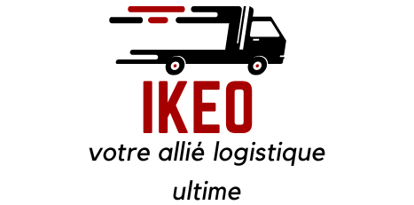

## Bienvenue au Projet Integrateur 2024

 IKEO, une application web dédiée à l'optimisation des plannings de livraison en entrepôt et à la gestion efficace des tournées des livreurs.



# Contributeurs:
##### - OURZIK    Jugurta
##### - OUKKAL    Yacine
##### - BOUQUETY  Andy
##### - MIEL      Nils
##### - FARINA    Alessandro
##### - MONACHON  Vivian

Niveau: Licence 3 MIAGE 
---

### Technologies & environements :

* Java/Springboot pour le back-end ( RO et server métier).
* PostgreSQL pour la base de données.
* Docker pour la conteneurisation de l'application.
* Angular et angularMaterial pour le front-end.
* Openrouteservice et data.gouv APIs pour la carte et le géocodage.
* Jest  et Junit pour les tests.

---

### Objectifs du projet:
* Développement d'un produit suivant des spécifications.
* Intégration des connaissances acquises au long de l'année universitaire 2023-2024.
* Maîtrise du Gitflow (features et branches, pull requests et  routines de revue de code ).
* Daily meetings et collaboration entre équipes.
* Mise en place de la méthodologie agile.
* Mise en place d'une organisation en pair programming.
* Exploration du DevOps.
* Compréhension de la philosophie de springboot et particulièrement le concept de l'inversion de contrôle à travers l'injection de dépendances.
* Maîtrise de l'architecture hexagonale.
* Maîtrise de la gestion d'erreurs.
* Compréhension plus approfondie de certaines notions vue en cours comme les observables en angular et les promesses.
* Maîtrise de l'architecture MVVM.
* Développement de test unitaires et de tests d'intégration.
* Mise en pratique des algorithmes vue en cours de la RO pour l'optimisations des itinéraires de livraison.

---

### Comment lancer le server
mettez vous à la racine du projet et sur la ligne de commande tapez la commande suivante:

```sh
  docker-compose -f docker/docker-compose-prod.yml up --build &
  ```
---

### Comment contribuer:

Ce que vous devez faire :

    Créer un projet (Fork).
    Cloner le repo forké localement.
    Ajouter quelques changements localement, pousser vers votre repo forké.
    Ensuite, lancez une pull request vers ce repo.

Pour plus de détails, voici les étapes à suivre.

    Tout d'abord, forker le projet sur github.

    Utilisez git pour cloner et installer votre projet forké localement.


    # après le clonage, naviguer vers le projet

    # pour synchroniser avec l'origine
    git remote add upstream <main_repo_url>
    git remote add origin <your_forked_repo_url>


    # pour configurer votre branche de développement locale
    git branch your_local_branch
    git checkout votre_branche_locale

    # pour ajouter vos modifications
    git add *
    git commit -m "+votre_branche_locale : votre commit ici"

    # pousser vers votre repo forké
    git push origin votre_branche_locale


# Ikeo Delivery - V1.0

### Version française :

L'application permet à un livreur de visualiser la tournée lui est associée pour la journée en cours.

Au démarrage de l'application :
- Le livreur saisit son adresse mail afin de créer un header d'identification pour les 
requêtes au serveur
- Il accède à un écran avec un bouton qui lui permet de visualiser la tournée qui lui est attribuée

Le processus de visualisation consiste en :
- Requête au serveur de la Tournée, en lui passant l'adresse mail du livreur en header
- Le serveur renvoie la Tournée sous la forme :
  - Tournée { Livraisons : Delivery[], Livreurs : DeliveryMan[], Camion : Truck }
- Le client se charge ensuite d'afficher l'équipe du livreur : Nom, Prénom des livreurs & Camion
- Le client affiche également les différentes livraisons sous forme de liste

---

### English version :

The app enables a delivery man to visualize an assigned delivery tour for the day.

On startup :
- The delivery man enters its e-mail address to create an identification header for
server requests
- He then has access to a view with a single button that enables him to visualize its assigned delivery tour

The visualization process consists in :
- Request the DeliveryTour to the server, forwarding its email in the request header
- The server communicates back the DeliveryTour :
  - DeliveryTour { Deliveries : Delivery[], DeliveryMan[], Truck }
- The client then displays the delivery man's team : Name, Surname of delivery men & Truck
- The client finally displays the deliveries as a list
